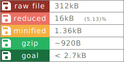

# ng-bundle-optimizer
Reducing bundle size with the help of (unit) tests

[Demo (minified)](https://willi84.github.io/ng-bundle-optimizer/demo/prod)
[Demo (raw for dev)](https://willi84.github.io/ng-bundle-optimizer/demo/dev)

[Demo (like ivy)](https://willi84.github.io/ng-bundle-optimizer/demo/ivy)

# current metrics
main bundle: new-foo.min.js

# requirements
## global

* node 9.11.1
* typescript 2.8.3
* @angular/cli: 6.0.1
* tslint 5.10.0

# used projects
* https://github.com/RisingStack/node-typescript-starter
* https://blog.risingstack.com/building-a-node-js-app-with-typescript-tutorial/
* https://journal.artfuldev.com/unit-testing-node-applications-with-typescript-using-mocha-and-chai-384ef05f32b2

# Links
* multiline badge inspired by:https://github.com/tanhauhau/generator-badge
* Ivy Demo: https://ng-ivy-demo.firebaseapp.com/

# data

* v1: angular5, foo.js is demo data, manually unminified, problem: testBed misconfigured the data

# TODO
* PEG.js
